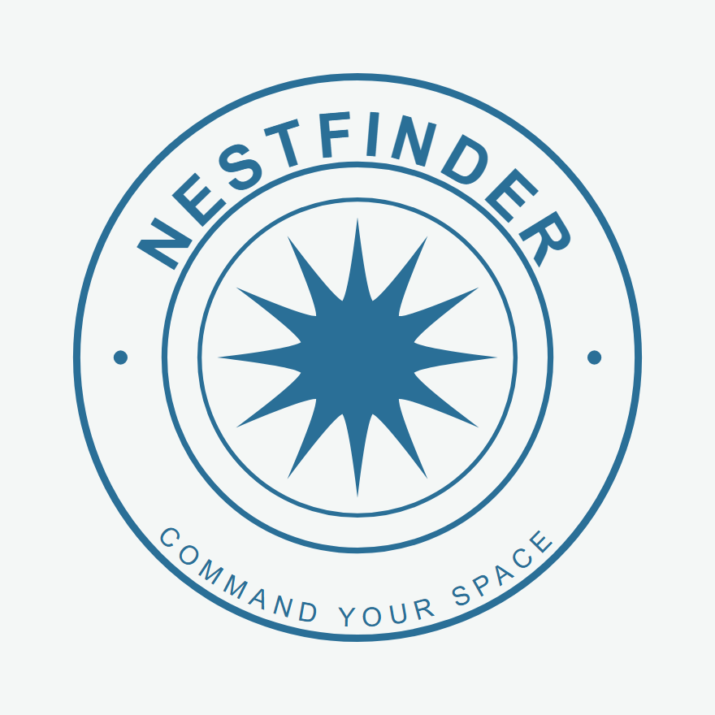

<p align="center">
  
</p>

<h1 align="center">NestFinder</h1>

<p align="center">
  <em>Command your space.</em><br />
  Off-campus accommodation for Nigerian students on SIWES industrial training.
</p>

---

A web platform that helps Nigerian students find off-campus accommodation for their SIWES placement.

SIWES (the Students Industrial Work Experience Scheme) sends students to work at a company for several months, often in a city where they know nobody and have no way to judge whether a room is real, safe, or a sensible distance from the office. NestFinder puts the available rooms in one place, lets a student compare them on the things that actually decide the choice, and gives landlords a way to list and manage their properties.

Final-year project, Abiola Ajimobi Technical University, Ibadan.

---

## Objectives

**i. Provide information on available off-campus accommodation for students on industrial training.**

Listings carry price, room type, address, amenities, photos and landlord contact. Each one is geocoded to real coordinates and shown on a map, so a student can see where a room actually is rather than trusting a text address.

- `server/models/Listing.js` — the listing record, including its GeoJSON location
- `server/services/geocodeListing.js` — turns an address into coordinates
- `client/src/pages/student/ListingDetailPage.jsx` — the listing page

**ii. Allow students to search and compare accommodation by price, location and facilities.**

Search filters on price range, city, area, room type and amenities. Results can be narrowed to a radius around the student's confirmed placement, so "near work" is a real distance rather than a guess. Up to three listings can be compared side by side, scored against priorities the student sets.

- `server/utils/listingFilter.js` — builds the query, shared by search and saved-search alerts so the two can never disagree
- `client/src/components/search/FilterPanel.jsx` — the filters
- `client/src/pages/student/ComparePage.jsx` — side-by-side comparison

**iii. Let landlords upload and manage accommodation listings.**

Landlords register, verify their identity, then create and edit listings with photo upload and a draggable map pin for when automatic geocoding gets the location wrong. Their dashboard shows enquiries and bookings.

- `client/src/components/landlord/ListingForm.jsx` — create and edit
- `client/src/pages/landlord/LandlordDashboard.jsx` — manage listings and enquiries
- `server/controllers/listingController.js` — the API behind both

---

## Beyond the objectives

- **SIWES placement matching** — a directory of 108 organisations in Ibadan that take industrial-training students, each with coordinates and the departments it accepts. A student sets their placement and the app can then rank housing by real distance to it. Students whose centre is not listed can submit it.
- **Bookings** — application and booking records with a full cost breakdown (rent, caution deposit, agent and legal fees), and reviews gated on a genuine completed stay.
- **Trust and safety** — email verification, identity (KYC) checks, duplicate-photo detection to catch listings copied from elsewhere, reporting, and an admin console for verification and moderation.
- **Saved searches** — a student can keep a search and be emailed when a new listing matches.

## Documentation

- **[USER_GUIDE.md](USER_GUIDE.md)** — how to use the app, step by step, for students, landlords and administrators
- **[DOCUMENTATION.md](DOCUMENTATION.md)** — architecture, data model, the full API reference, security design and the reasoning behind the significant decisions
- **[DEPLOYMENT.md](DEPLOYMENT.md)** — deploying to a live environment

## Built with

**Frontend** — React 19, Vite, Tailwind CSS, React Router, Framer Motion, Leaflet for maps
**Backend** — Node.js, Express 5, MongoDB with Mongoose, Socket.IO for messaging, JWT auth in httpOnly cookies
**Testing** — Vitest, Supertest, React Testing Library, mongodb-memory-server

## Running it locally

**You will need:** Node.js 20 or 22, and a MongoDB database (a free MongoDB Atlas cluster is fine).

**1. Install**

```bash
cd server && npm install
cd ../client && npm install
```

**2. Configure the server**

Copy `server/.env.example` to `server/.env` and fill it in. At minimum you need `MONGO_URI` and `JWT_SECRET`. Email, CAPTCHA and image services are optional — the app runs without them and prints emails to the console instead of sending them.

```bash
cd server
cp .env.example .env
```

**3. Start both halves** (two terminals)

```bash
cd server && npm run dev     # http://localhost:5000
cd client && npm run dev     # http://localhost:5173
```

**4. Optional — load sample data**

```bash
cd server
node scripts/seedCompanies.js   # the 108 Ibadan placement organisations
node seedListings.js            # a few demo listings
node createAdmin.js             # admin account; set ADMIN_EMAIL and
                                # ADMIN_PASSWORD in .env first
```

## Tests

```bash
cd server && npm test    # 229 tests
cd client && npm test    #  42 tests
```

The server tests run against an in-memory MongoDB, so they need no database and touch nothing real. Every push runs both suites plus a production build on Node 20 and 22 via GitHub Actions (`.github/workflows/ci.yml`).

## Layout

```
client/
  src/
    components/     shared UI, grouped by area (listing, search, landlord, admin…)
    pages/          one folder per role: student, landlord, admin
    context/        auth, compare, saved, notifications
    hooks/          reusable behaviour
    utils/          pricing, distance, scoring helpers
server/
  models/           Mongoose schemas
  controllers/      request handling
  routes/           API endpoints
  services/         geocoding, email, image processing, fraud checks
  middleware/       auth, verification gates, uploads
  tests/            Vitest + Supertest
  scripts/          seed and maintenance scripts
```

## Deploying

See [DEPLOYMENT.md](DEPLOYMENT.md). `render.yaml` is set up for Render, but nothing is tied to that host.

Set a fresh `ADMIN_PASSWORD` for any deployment — never reuse a development one.

---

Idris Bello
